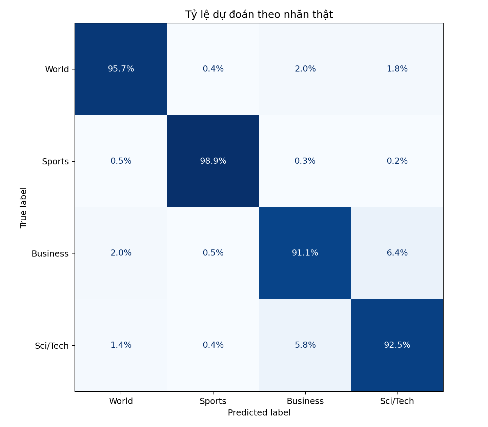
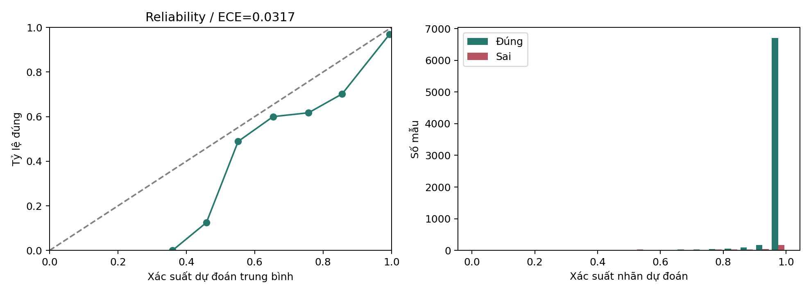

# Báo cáo đánh giá B2 trên tập test

Accuracy: 0.945658; Macro F1: 0.945652; đúng 7187/7600; sai 413. Accuracy CI95: 0.940526–0.950135; Macro F1 CI95: 0.940571–0.950232. ECE: 0.031692; Brier (tổng bốn lớp): 0.089448.

Đây là đánh giá lại checkpoint đã chốt, không phải thí nghiệm độc lập mới. Khoảng tin cậy bootstrap phản ánh biến động do lấy mẫu test, không đo độ ổn định qua seed huấn luyện. Xác suất softmax là mức tự tin của model, không phải bảo đảm đúng. ECE dùng 10 khoảng đều; Brier là tổng sai số bình phương trên bốn lớp. Phân tích độ dài dùng số từ tách bằng khoảng trắng, không phải token BERT. Test thuộc AG News; không dùng các lỗi test để chỉnh model rồi báo lại điểm trên cùng test.

