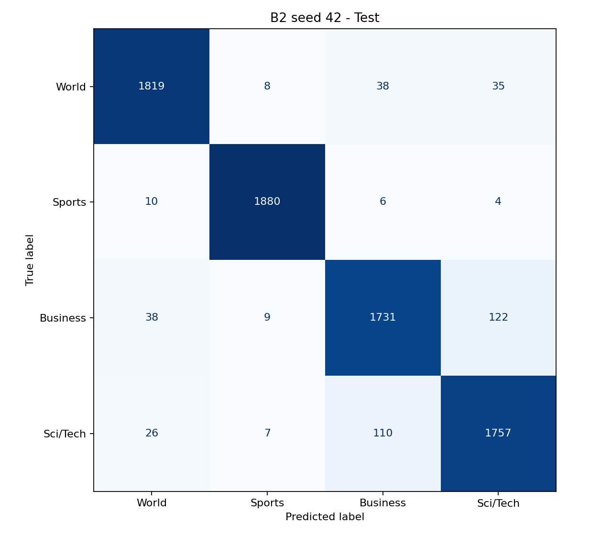
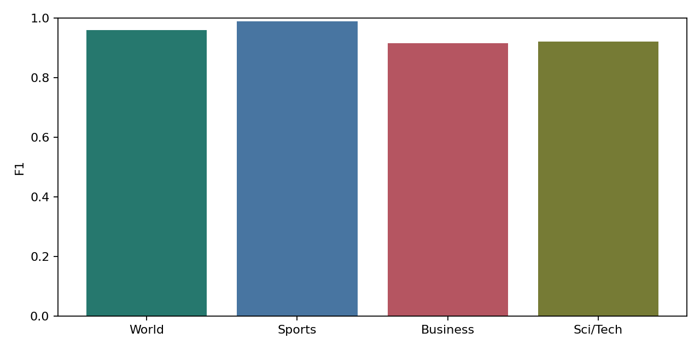

# Báo cáo final-test B2

- Model: B2_bert_finetuned_cls_seed42, epoch 3.
- Số mẫu test: 7600.
- Accuracy: 0.945658.
- Macro F1: 0.945652.
- Loss: 0.203940.
- Macro F1 validation: 0.948616.
- Chênh lệch test - validation: -0.002963.

Model được chọn bằng validation trước khi truy cập test. Chỉ đánh giá một seed; chưa đo độ ổn định qua nhiều seed. Test thuộc AG News, không đại diện đầy đủ cho BBC/HuffPost. Chênh lệch validation/test không tự chứng minh overfitting.

Xem `../metrics/per_class_metrics.csv` để đối chiếu từng nhãn và `../predictions/errors.csv` để đọc mẫu sai; row_index là vị trí dòng 0-based trong test. Dự đoán NPZ chứa logits, labels, predictions, row_index, texts.

